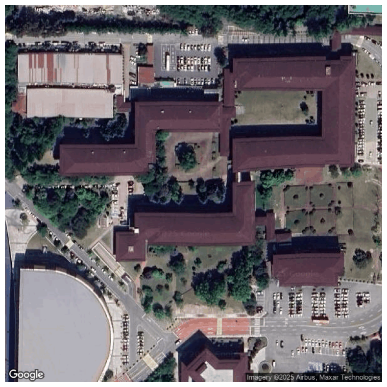
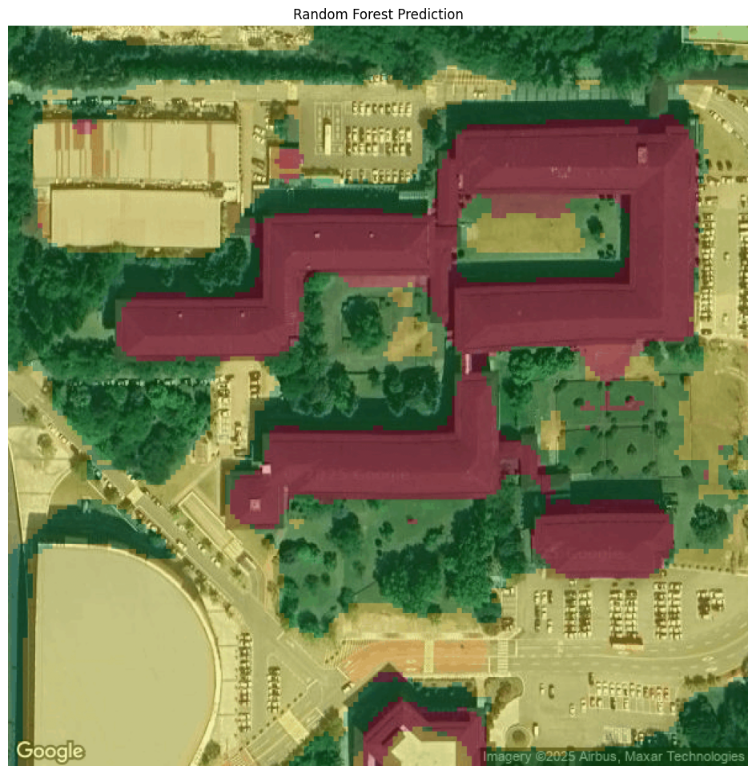

# lecture

Seminar at the School of Digital Humanities and Computational Social Science, Korea Advanced Institute of Science and Technology (KAIST)

- Guest Lecturer: Kyungmin Lee, Ph.D. (kmlee@udel.edu)
- Date: Nov 12, 2025

This notebook is created for learning the basic process of image segmentation (e.g., parking lots, roofs, trees).
The notebook contains information about five steps:
Step 1. Load Satellite Images Using the Google Maps API
Step 2. Label Pixels
Step 3. Create Patches
Step 4. Build a Random Forest Classifier
Step 5. Visualize Predicted Images

The results will be shown in the figures below:

## Figure 1. KAIST Satellite Image Tiles

## Figure 2. KAIST Satellite Image Test Tile

## Figure 3. Random Forest Prediction

Before processing the notebook, please note that you need to 1) change the file directory name and 2) obtain your Google Maps API key to run the code.

If you have any further questions, please feel free to email me.

